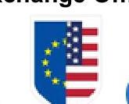
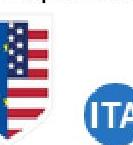
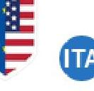
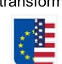
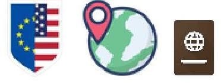

import restructions/taxes on electroniques devices to morocco
Importing electronic devices into Morocco involves compliance with customs regulations, import duties, taxes, and specific standards. Below is a detailed overview of the import laws, restrictions, taxes, and requirements for electronic devices in Morocco, based on the latest available information, including relevant web sources.

# 1. Import Regulations for Electronic Devices 

Morocco has specific regulations to ensure the quality, safety, and compliance of imported electronic devices. These regulations are enforced by the Moroccan Customs Service (Administration des Douanes et Impôts Indirects) and other authorities, such as the Ministry of Industry and Trade.

- Verification of Conformity (VoC) Program:
- Since February 1, 2020, Morocco's Verification of Conformity (VoC) program, managed by the Ministry of Industry, Investment, Trade, Green and Digital Economy (MCINET), requires that imported electronic devices comply with Moroccan technical regulations and quality standards (e.g.,

## Moroccan Standards - NM)

- Covered electronics include consumer products like mobile phones, computers, and household appliances. Specific components, such as batteries, may also require conformity checks.
- A Certificate of Conformity (CoC) is mandatory for customs clearance and must be obtained from an approved inspection body (e.g., Intertek, SGS, or Bureau Veritas) in the exporting country, such as the UK. (C)
- Some products may require destination inspection in Morocco to verify compliance, particularly for complex electronics or components like motor vehicle spare parts (e.g., batteries). (C)
- Exporters must provide technical documentation to demonstrate compliance with Moroccan standards. Failure to provide a CoC can result in delays, fines, or rejection of the shipment. (C)

## - Customs Documentation:

- Required documents for importing electronics include:
- Commercial Invoice: Must include the supplier's letterhead, HS (Harmonized System) code, value of goods, currency for payment, and buyer's address. Pro-forma invoices are acceptable in most cases. (1A
- Bill of Lading: Must show Morocco as the final destination and the

UK as the point of origin.

- Certificate of Non-Manipulation: Required to confirm that goods have not undergone substantial transformation (e.g., repacking orrelabeling) in a third country, especially for eligibility under trade
agreements like the UK-Morocco Association Agreement.

- Import Commitment (Engagement d'Importation): Authorization from the Foreign Exchange Office for transferring foreign currency to
pay foreign suppliers.

- Customs Declaration (Déclaration de Douane): Required for all imports through ports or airports. For postal shipments, a simplified

form at the post office may replace this.

- Certificate of Conformity: As mentioned, required for regulated electronics. $\square$
- Additional technical documentation (e.g., product specifications, safety
certifications) may be requested to assist customs officials.

- Rules of Origin:
- Under the UK-Morocco Association Agreement (successor to the EU-Morocco Agreement, effective post-Brexit), electronic devices originating in the UK can benefit from tariff-free or reduced-tariff treatment if they meet rules of origin requirements. This typically means the goods must be wholly obtained in the UK or have undergone sufficient transformation (e.g., at least $35 \%$ regional value content from UK materials and processing).
- A Statement on Origin or supplier's declaration, signed by the exporter, is required to claim preferential treatment. For example: "We certify that the goods named in this invoice are manufactured and originated in the UK."
- Goods transshipped through a third country must not undergo substantial transformation (e.g., repacking or relabeling) to maintain preferential status.

- Prohibited and Restricted Items:
- Prohibited Items: Weapons, ammunition, narcotics, psychotropic substances, and media contrary to public morals or order (e.g., pornography)are banned. These restrictions may apply to certain electronic devices
containing prohibited content or components.

- Restricted Items: Electronic devices for personal use (e.g., laptops, phones, cameras) are generally allowed without an import license, provided they are declared and accompanied by appropriate documentation (e.g., proof of

- Radio Equipment: Devices with radio or telecommunications functions (e.g., mobile phones, Wi-Fi routers) may require approval from the National Telecommunications Regulatory Agency (ANRT) to ensure compliance with Moroccan frequency and safety standards.
- Drones: Considered restricted due to potential security concerns. Importing drones typically requires a permit from the Ministry of Interior or other
relevant authorities.

- Personal Use Exemptions:
- Travelers can import electronics for personal use (e.g., phones, laptops, cameras) without an import license, but these must be declared if their value
exceeds duty-free allowances (e.g., MAD 2,000 for residents).

- For personal electronics exceeding the duty-free limit, customs duties and taxes apply unless exempted under specific conditions.

# 2. Import Duties and Taxes 

- Customs Duties:
- Import duties on electronic devices typically range from $\mathbf{2 . 5 \%}$ to $\mathbf{3 5 \%}$, depending on the product's HS code and whether it qualifies for preferential treatment under the UK-Morocco Association Agreement. (17)
- For electronics requiring further processing or assembly in Morocco (e.g., components for manufacturing), duties may be reduced. (17)
- To confirm the exact duty rate, use the Moroccan Customs Tariff Database or consult the Moroccan Customs Service (www.douane.gov.ma).
- Value Added Tax (VAT):- A VAT of $\mathbf{2 0 \%}$ is applied to most imported electronic devices, calculated on
the CIF (Cost, Insurance, Freight) value plus import duties.
- Reduced VAT rates of $\mathbf{7 \%}$ or $\mathbf{1 0 \%}$ may apply to specific electronics or
components, but this is less common.
- VAT is payable at the time of customs clearance unless the importer qualifies for exemptions (e.g., under investment programs or trade agreements).
- Para-Fiscal Tax:
- A $\mathbf{0 . 2 5 \%}$ para-fiscal tax is applied to imports to fund activities like technical inspections, export promotion, and industrial development.
- Exemptions from the para-fiscal tax apply to goods qualifying for special customs procedures, investment programs, or preferential trade agreements.

# (17) 

- Recent Tariff Changes:
- As of April 2025, Morocco increased customs duties on household appliances from $\mathbf{2 . 5 \%}$ to $\mathbf{3 0 \%}$ to support the national appliance industry. This may affect certain electronic devices classified as household appliances (e.g., refrigerators, washing machines). It's unclear if this applies to all electronics, so check the specific HS code with the Moroccan Customs Service.

## 3. Additional Considerations

- Standards and Safety:
- Electronic devices must comply with Moroccan Standards (NM), managed by the Moroccan Standards Institute (IMANOR). For example, devices must meet safety and electromagnetic compatibility requirements, similar to

EU CE marking standards.

- Non-compliant devices may be subject to testing upon arrival, which can cause delays. Ensure pre-export verification through an accredited body. ${ }^{(1)}$
- Currency Regulations:
- There is no limit on importing foreign currency (e.g., GBP, USD) to pay for electronics, but amounts equivalent to MAD 100,000 or higher must be
declared to customs.- The Moroccan Dirham (MAD) cannot be imported or exported, so payments must be made in foreign currency, and an exchange slip may be required for re-exporting unspent currency. ${ }^{834}$
- Intellectual Property (IP):
- IP rights are territorial, so UK-registered IP protections do not apply in Morocco. Exporters should consider registering trademarks or patents in Morocco to protect electronic devices with proprietary technology. Contact the Moroccan Office of Industrial and Commercial Property (OMPIC) or the

UK's International IP Service for guidance.

- Sanctions and Embargoes:
- As of the latest information, Morocco is not subject to UK or international sanctions that would restrict electronics imports. However, confirm with the UK's Export Control Joint Unit (ECJU) and Moroccan authorities for any updates. 83

# - Data Protection for Smart Devices: 

- Smart electronics (e.g., loT devices, phones) that process personal data must comply with Morocco's Data Protection Law (Law No. 09-08). Direct marketing via electronic devices (e.g., email, SMS) requires prior consent from users, except for existing customers purchasing similar products. ${ }^{836}$

## 4. Practical Steps for Importers

1. Classify the Goods: Determine the correct HS code for your electronic devices using the Moroccan Customs Tariff Database to identify duties, taxes, and restrictions.
2. Obtain a Certificate of Conformity: Arrange for pre-export verification through an accredited body (e.g., Intertek) to ensure compliance with Moroccan standards. ${ }^{83}$
3. Prepare Documentation: Ensure all required documents (invoice, bill of lading,

CoC, import commitment, etc.) are complete and accurate.
4. Claim Preferential Treatment: Provide a Statement on Origin to benefit from tariff reductions under the UK-Morocco Association Agreement.
5. Check Radio Equipment Requirements: For devices with wireless functions, confirm compliance with ANRT regulations and obtain necessary approvals.
6. Hire a Customs Agent: Use a freight forwarder or customs broker (e.g., UPS, TecEx) to navigate Moroccan customs procedures and avoid delays.7. **Declare Currency**: If importing high-value electronics, declare foreign currency exceeding MAD 100,000 and retain exchange slips.

8. **Verify Destination Inspection**: Confirm if your electronics require inspection upon arrival in Morocco and prepare for potential testing.

## 5. Key Resources

- **Moroccan Customs Service**: www.douane.gov.ma for tariffs, documentation, and regulations.
- **Moroccan Standards Institute (IMANOR)**: For NM standards and compliance requirements (website in French).
- **Ministry of Industry and Trade**: For VoC program details and product lists.
- **UK Export Support Service**: For guidance on exporting to Morocco.
- **Intertek or SGS**: For obtaining Certificates of Conformity.
- **UK-Morocco Association Agreement**: For rules of origin and tariff benefits.

## Notes

- Regulations may vary for specific electronic devices (e.g., medical devices, drones), so provide details about the products for a more tailored response.
- The increased duties on household appliances (30% as of April 2025) may impact certain electronics, but clarification is needed for non-appliance devices. Always verify with the Moroccan Customs Service for the latest HS code-specific rates.
- For complex or high-volume imports, consult a customs broker or contact the Moroccan Customs Service directly via www.douane.gov.ma.